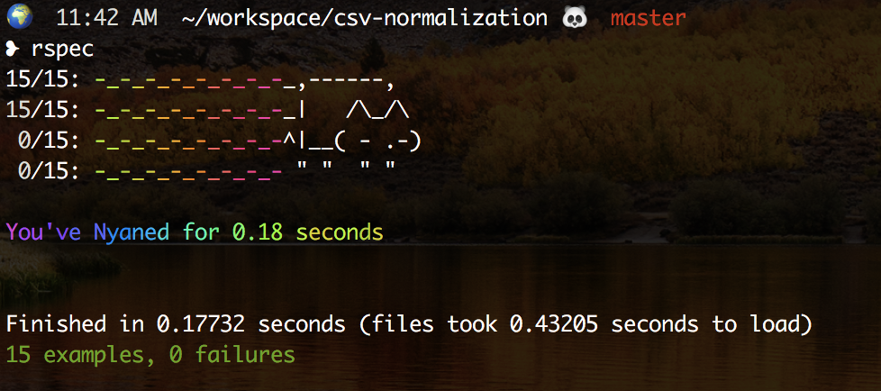

# CSV Normalization

This is a tool that reads CSV formatted files from `stdin` and outputs a parsed version via `stdout` (unless an output csv file is specified). This parser enforces UTF-8 character encoding and specifically normalizes the following: 
* Timestamp: 
   * converted to mISO860 format 
   * converted from pacific to eastern timezone
   * if there is null timezone, assumes pacific
* Address: 
   * left as is, except for the general UTF-8 char enforcement 
* Zip: 
   * 5 digit validation 
      * if 5 digits, left as is 
      * if less than 5 digits, 0 is used as prefix 
      * if greater than 5 digits (e.g. 12345-1234), digits past `-` are removed
* Full Name: 
   * converted to UPPERCASE 
   * accounts for non-ASCII characters
* FooDuration & BarDuration: 
   * converted to floating points seconds format (with 3 decimal places)
* Total Duration: 
   * sum of FooDuration and BarDuration 
* Notes 
   * left as is, except for the general UTF-8 char enforcement  

## To setup:

_This normalizer will work best using Ruby version 2.3.0 or higher._

- clone repo 
- run `bundle install` 

## To normalize CSVs:
From the root directory, run `ruby run_normalizer.rb`. By default a `sample.csv` file will be parsed and outputted via `stdout`. You can specify a file to parse by running `ruby run_normalizer.rb {path-to-csv}` and likewise, you can specify an output file by running `ruby run_normalizer.rb {path-to-csv} output.csv`. 

## Testing:

Testing tool: RSpec 
To run tests run `rspec` from root directory. Example output: 

